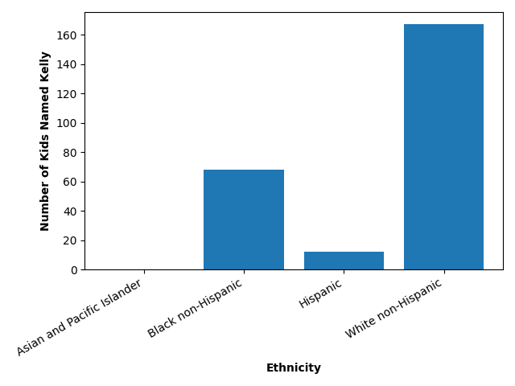

# Visualizing Data Sets 
by Shae Delany

## Distribution of the Name "Kelly" by Ethnicity from 2011-2021

The bar chart displays the distribution of the name “Kelly” by ethnicity from 2011 to 2021, based on New York City birth records. The data shows that the name was most commonly given among White non-Hispanic individuals (167 occurrences), followed by Black non-Hispanic (68), and Hispanic (12). This suggests cultural or naming preferences vary significantly across ethnic groups during this time period.

[View the original data source here](https://catalog.data.gov/dataset/popular-baby-names)

## Monthly Crime Trends in Chicago (2024–2025)

The line graph illustrates monthly crime trends in Chicago from 2024 to 2025, highlighting total crimes, thefts, battery incidents, and narcotics-related offenses. Over the two-year span, there were 250,454 reported crimes, with thefts being the most prevalent at 59,298 cases. Battery followed closely with 44,794 incidents, while narcotics-related crimes totaled 6,465. The graph provides insight into how these major crime categories fluctuate over time. The data was aggregated monthly to highlight fluctuations over time and to provide a clearer picture of patterns in criminal activity.

[View the original data source here](https://catalog.data.gov/dataset/crimes-one-year-prior-to-present)

## Other Information

[Link to Project Instructions](https://github.com/mikeizbicki/cmc-csci040/tree/2025spring/project_02_visualizing_datasets)

[Link to Class Github](https://github.com/mikeizbicki/cmc-csci040/tree/2025spring)

[Link to Professor Izbicki's Webpage](https://izbicki.me/research.html)
